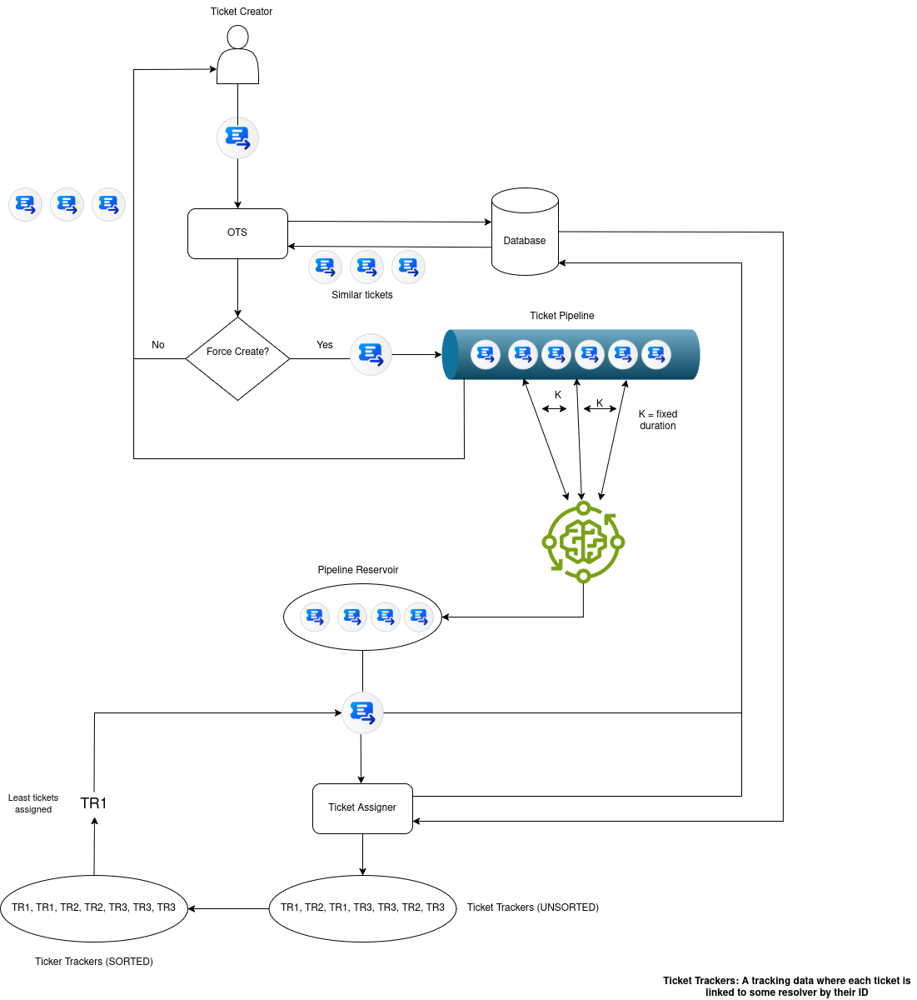

# Open Ticket System (OTS)

Open Ticket System (OTS) is a project designed to streamline the process of managing support tickets efficiently and effectively.

## Project/System Architecture

Below is the architecture diagram for the Open Ticket System:

## Features

- User-friendly interface for ticket submission.
- Robust tracking of ticket status.
- Administrative dashboard for managing tickets and users.

## Getting Started

Instructions on how to set up and run the project will be added here.

## Contribution

We welcome contributions! Please check the guidelines for contributing to this project.

## License

Licensing instructions will be added here.
